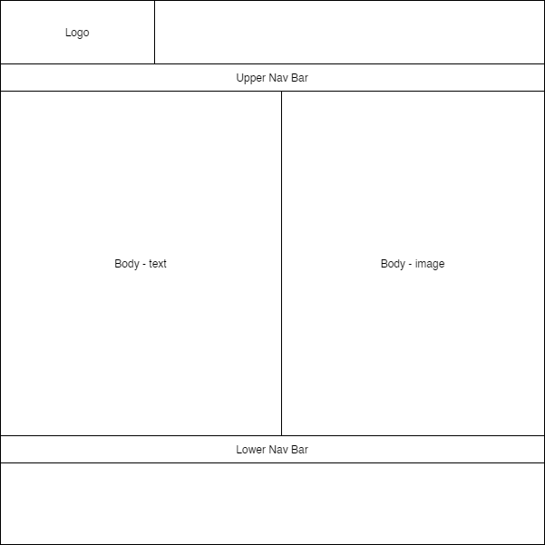
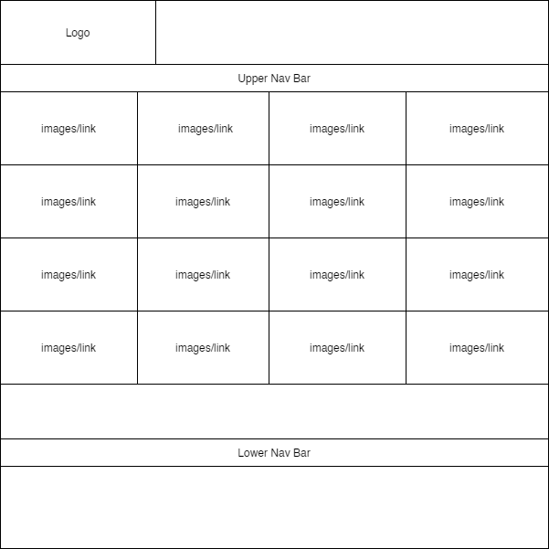

# Nan Lieu
# CDA404 Practical Assignment

# Github URL
https://github.com/NanLieu/CDA404-Web-Technologies/tree/master/practical_assessment_1

## Background
For this project, I was looking to add additional communication methods to the Lockheed Martin website. The current website has contact us page, however it only provides phone numbers and email addresses. Therefore, I have created a version of the Lockheed Martin website and added 2 additional web pages that would allow visitors to communicate with Lockheed either through a contacts page or a live chat as an alternative method of making contact. 

## Wire Frames
**index.html**

**products-capabilities.html**

**career.html**

**contact-us.html**

## Colour Choices

## Accessibility

### Page Titles

### Images

### Headings

### Contrast Ratio

### Text Resizing

### Keyboard Access and Visual Focus

### Forms, Labels, and Errors

## GDPR

## Distance Selling

## Evaluation