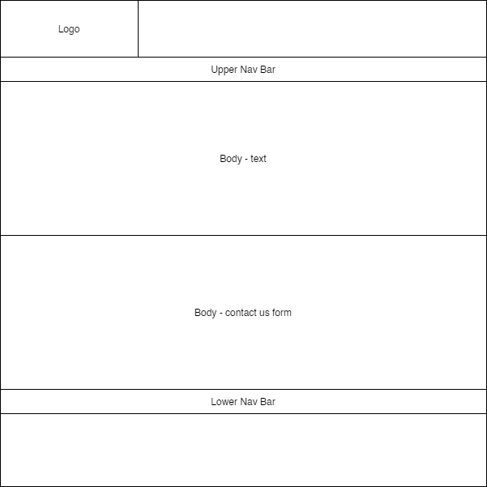

# Nan Lieu
# CDA404 Practical Assignment

# Github URL
https://github.com/NanLieu/CDA404-Web-Technologies/tree/master/practical_assessment_1

## Background
For this project, I was looking to add additional communication methods to the Lockheed Martin website. The current website has contact us page, however it only provides phone numbers and email addresses. Therefore, I have created a version of the Lockheed Martin website and added 2 additional web pages that would allow visitors to communicate with Lockheed either through a contacts page or a live chat as an alternative method of making contact. 

## Wire Frames
**index.html**

**products-capabilities.html**

**career.html**

**contact-us.html**

## Colour Choices
For the colour choices, I kept it simple and tried to use the same colour as the Lockheed Martin's logo to keep in line with the colour scheme. With the contrasting blue and white will allow text to be visible under the nav bar and kept a simple black and white for the text in the background for legibility.

## Accessibility
Once the website was completed, it was checked over using the [Easy Checks – A First Review of Web Accessibility](https://www.w3.org/WAI/test-evaluate/preliminary/) to ensure that the website has high level of accessibility as possible.

### Page Titles
Confirmed that each web pages have been allocated a page title.

### Images
Confirmed images have alternative text to convey the purpose of the images.

### Headings
Confirmed 

### Contrast Ratio

### Text Resizing

### Keyboard Access and Visual Focus

### Forms, Labels, and Errors

## GDPR

## Distance Selling

## Evaluation